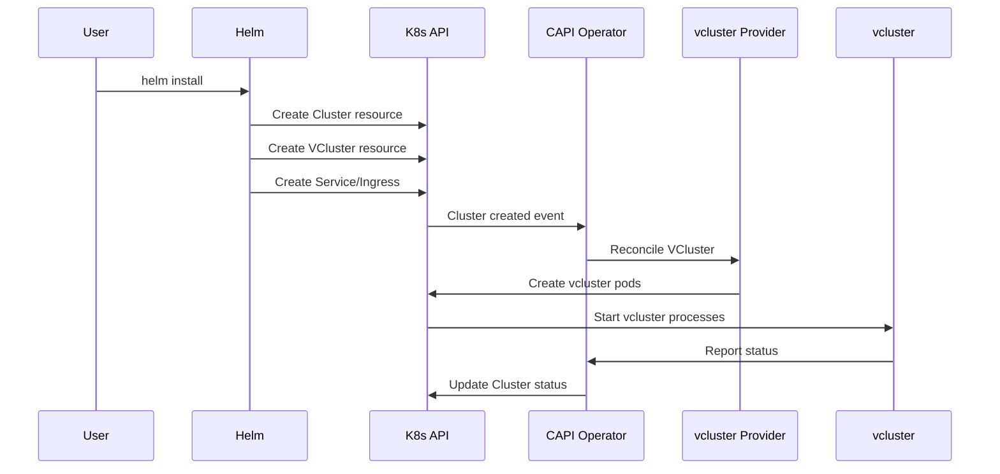
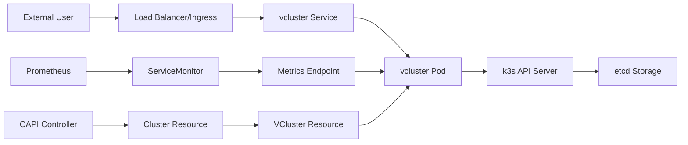

# Architecture Overview

This document describes the technical architecture and design decisions of the ITL K8s CAPI Helm chart.

## Table of Contents

- [High-Level Architecture](#high-level-architecture)
- [Component Architecture](#component-architecture)
- [Data Flow](#data-flow)
- [Design Decisions](#design-decisions)
- [Scalability Considerations](#scalability-considerations)
- [Security Architecture](#security-architecture)

## High-Level Architecture

```
┌─────────────────────────────────────────────────────────────────┐
│                    Management Cluster                          │
├─────────────────────────────────────────────────────────────────┤
│  ┌─────────────────┐  ┌─────────────────┐  ┌─────────────────┐  │
│  │  Cluster API    │  │   vcluster      │  │   Monitoring    │  │
│  │   Operator      │  │   Provider      │  │     Stack       │  │
│  └─────────────────┘  └─────────────────┘  └─────────────────┘  │
│          │                     │                     │          │
│          └─────────────────────┼─────────────────────┘          │
│                                │                                │
│  ┌─────────────────────────────┼─────────────────────────────┐  │
│  │              vcluster Instance                           │  │
│  │  ┌─────────────────┐  ┌─────────────────┐  ┌─────────────┐│  │
│  │  │  k3s API Server │  │   etcd Storage  │  │  Workloads  ││  │
│  │  └─────────────────┘  └─────────────────┘  └─────────────┘│  │
│  └─────────────────────────────────────────────────────────────┘  │
└─────────────────────────────────────────────────────────────────┘
```

### Components Overview

1. **Management Cluster**: The main Kubernetes cluster hosting the CAPI components
2. **Cluster API Operator**: Manages CAPI lifecycle and provider installations
3. **vcluster Provider**: CAPI infrastructure provider for vcluster
4. **vcluster Instance**: The virtual Kubernetes cluster running as pods
5. **Helm Chart**: Our orchestration layer tying everything together

## Component Architecture

### Helm Chart Structure

```
ITL.K8s.Capi Chart
├── Global Configuration Layer
├── CAPI Resource Layer
│   ├── Cluster Resources
│   ├── Infrastructure Resources
│   └── Provider Configuration
├── vcluster Configuration Layer
│   ├── Core vcluster Settings
│   ├── Storage Configuration
│   └── Networking Setup
├── External Access Layer
│   ├── Service Resources
│   ├── Ingress Resources
│   └── Load Balancer Config
├── Monitoring Layer
│   ├── ServiceMonitor
│   ├── Metrics Endpoints
│   └── Alerting Rules
└── Security Layer
    ├── RBAC Resources
    ├── Network Policies
    └── Security Contexts
```

### Template Architecture

#### Core Templates

1. **`_helpers.tpl`**: Shared template functions
2. **`vcluster.yaml`**: Main CAPI resources (Cluster, VCluster)
3. **`service.yaml`**: Service resources for external access
4. **`ingress.yaml`**: Ingress configuration
5. **`servicemonitor.yaml`**: Prometheus monitoring integration

#### Template Functions

```yaml
# Naming functions
- itl-k8s-capi.name
- itl-k8s-capi.fullname
- itl-k8s-capi.vclusterName
- itl-k8s-capi.vclusterNamespace

# Label functions  
- itl-k8s-capi.labels
- itl-k8s-capi.selectorLabels
- itl-k8s-capi.annotations

# Utility functions
- itl-k8s-capi.chart
- itl-k8s-capi.chartVersion
```

### Data Model

#### Values Structure

```yaml
global:              # Global configuration
  environment: string
  labels: map
  annotations: map

vcluster:            # Core vcluster configuration
  name: string
  namespace: string
  cluster:
    kubernetesVersion: string
  helmRelease:
    values: object   # Passed to vcluster chart

externalAccess:      # External connectivity
  enabled: boolean
  type: enum[LoadBalancer|Ingress|NodePort]
  ingress: object
  loadBalancer: object
  nodePort: number

monitoring:          # Observability
  enabled: boolean
  serviceMonitor: object
  metrics: object

highAvailability:    # HA configuration
  enabled: boolean
  replicas: number
  affinity: object
  podDisruptionBudget: object

security:            # Security settings
  rbac: object
  networkPolicy: object
  securityContext: object
```

## Data Flow

### Installation Flow



### Runtime Data Flow



## Design Decisions

### 1. Cluster API Integration

**Decision**: Use Cluster API instead of direct vcluster deployment

**Rationale**:
- Standardized cluster lifecycle management
- Better integration with multi-cluster scenarios
- Consistent API across different infrastructure providers
- Enhanced observability and status reporting
- Future-proofing for hybrid/multi-cloud scenarios

**Trade-offs**:
- Additional complexity vs direct vcluster deployment
- Extra resource overhead from CAPI components
- Learning curve for operators familiar with vcluster only

### 2. Helm-based Architecture

**Decision**: Package as Helm chart with multiple value files

**Rationale**:
- GitOps-friendly deployment model
- Environment-specific configuration management
- Template reusability across deployments
- Integration with existing Helm-based workflows
- Easier customization and extension

**Trade-offs**:
- Template complexity vs simple YAML manifests
- Helm dependency for operations teams
- Potential template debugging challenges

### 3. Multi-tenancy Design

**Decision**: One chart deployment per vcluster instance

**Rationale**:
- Clear resource ownership and boundaries
- Independent lifecycle management
- Simplified RBAC and security policies
- Better resource isolation and troubleshooting
- Flexibility in configuration per tenant

**Trade-offs**:
- More Helm releases to manage
- Potential resource duplication
- Complex multi-tenant orchestration

### 4. External Access Strategy

**Decision**: Support multiple access methods (LoadBalancer, Ingress, NodePort)

**Rationale**:
- Different environments have different networking constraints
- Flexibility for cloud vs on-premises deployments
- Security considerations vary by use case
- Cost optimization options (LoadBalancer costs)

**Implementation**:
```yaml
# Conditional resource creation based on access type
{{- if eq .Values.externalAccess.type "LoadBalancer" }}
# LoadBalancer service
{{- else if eq .Values.externalAccess.type "Ingress" }}
# Ingress resource
{{- end }}
```

### 5. Configuration Management

**Decision**: Nested configuration with vcluster.helmRelease.values

**Rationale**:
- Direct pass-through of vcluster chart values
- Maintains compatibility with upstream vcluster
- Reduces configuration mapping complexity
- Easier to track upstream changes

**Structure**:
```yaml
vcluster:
  # Our chart-specific config
  name: "cluster-name"
  namespace: "target-namespace"
  
  # Direct pass-through to vcluster chart
  helmRelease:
    values:
      replicas: 3
      resources: {...}
      storage: {...}
```

## Scalability Considerations

### Horizontal Scalability

1. **Multiple vclusters**: Each chart instance creates one vcluster
2. **Resource isolation**: Independent resource allocation per vcluster
3. **Namespace isolation**: Each vcluster in separate namespace
4. **Load distribution**: Anti-affinity rules spread workload

### Vertical Scalability

1. **Resource configuration**: CPU/memory limits configurable per vcluster
2. **Storage scaling**: Persistent volume size configuration
3. **Replica scaling**: HA mode with configurable replica count

### Operational Scalability

1. **Monitoring**: Centralized metrics collection via ServiceMonitor
2. **Logging**: Structured logging with configurable levels
3. **Backup**: Automated backup with configurable retention
4. **Upgrading**: Rolling updates with minimal downtime

### Limits and Constraints

| Resource | Recommended Limit | Notes |
|----------|------------------|--------|
| vclusters per namespace | 1 | Security and management best practice |
| vclusters per node | 5-10 | Depends on node resources |
| vclusters per cluster | 50-100 | Depends on cluster size and workload |
| Concurrent deployments | 5 | Helm deployment concurrency |

## Security Architecture

### Defense in Depth

1. **Network Layer**:
   - Network policies for traffic control
   - Service mesh integration capability
   - Ingress TLS termination

2. **Pod Security**:
   - Security contexts with non-root users
   - Pod Security Standards enforcement
   - Resource limits and quotas

3. **API Security**:
   - RBAC for fine-grained permissions
   - Service account isolation
   - Kubernetes API server security

4. **Data Security**:
   - Encrypted storage at rest
   - TLS for data in transit
   - Backup encryption

### Trust Boundaries

```
┌─────────────────────────────────────────┐
│            Management Cluster           │
│  ┌─────────────────────────────────────┐│
│  │         vcluster Namespace          ││
│  │  ┌─────────────────────────────────┐││
│  │  │       vcluster Instance         │││
│  │  │  ┌─────────────────────────────┐│││
│  │  │  │      Workload Pods          ││││
│  │  │  └─────────────────────────────┘│││
│  │  └─────────────────────────────────┘││
│  └─────────────────────────────────────┘│
└─────────────────────────────────────────┘

Trust Boundary 1: Management cluster isolation
Trust Boundary 2: Namespace-level isolation  
Trust Boundary 3: vcluster API server isolation
Trust Boundary 4: Pod-level security contexts
```

### Security Controls

1. **Authentication**: 
   - Kubernetes service account authentication
   - Optional integration with external identity providers

2. **Authorization**:
   - RBAC policies for chart resources
   - vcluster internal RBAC configuration
   - Network policy enforcement

3. **Audit**:
   - Kubernetes audit logging
   - vcluster API server audit logs
   - Resource change tracking

## Future Architecture Considerations

### Planned Enhancements

1. **Multi-cluster Support**: CAPI cluster classes for different infrastructure
2. **Advanced Networking**: Service mesh integration templates
3. **Enhanced Monitoring**: Custom metrics and alerting rules
4. **Automated Scaling**: HPA integration for vcluster components
5. **Disaster Recovery**: Cross-region backup and restore capabilities

### Extension Points

1. **Custom Resources**: Support for additional CRDs
2. **Hooks**: Pre/post deployment automation
3. **Subcharts**: Integration with complementary charts
4. **Plugin Architecture**: Custom vcluster plugins support

This architecture provides a solid foundation for enterprise-grade vcluster deployments while maintaining flexibility for various use cases and environments.
